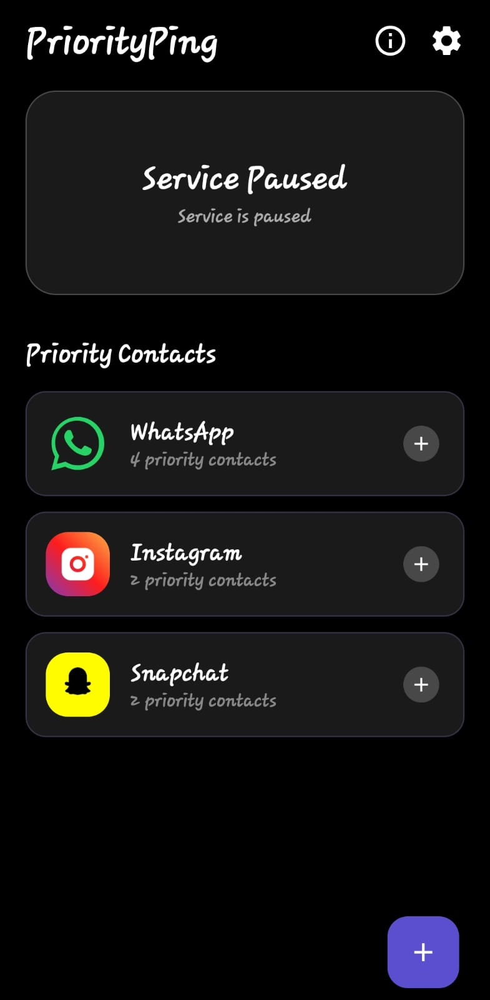
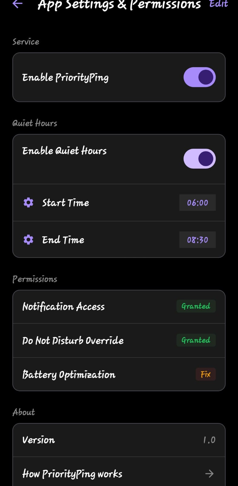

# PriorityPing 🔔

Priority-based notification manager that ensures important messages break through Silent & DND.

👉 Never miss messages from people who matter.

## 🌟 Key Features

- **Priority Alerts:** Set specific contacts from WhatsApp, Instagram, and Snapchat as "Priority."
- **Silent Mode Bypass:** High-priority alerts will play a notification sound and vibrate even if your phone is in Silent or Vibrate mode.
- **Custom Vibrations:** Choose between different vibration intensities (Light, Normal, Hard, Very Hard) for your contacts.
- **Quiet Hours:** Schedule times when the app should stay quiet (e.g., during sleep).
- **Dark Mode UI:** A modern, clean, and easy-to-use dark interface.

## ⚙️ How it works

- Uses Notification Listener Service to monitor notifications  
- Filters based on selected contacts/apps  
- Triggers alert even in Silent / DND mode  
- Runs as a background service with battery optimization handling  

## 🚀 How to Use

### 1. Initial Setup
When you first open the app, you'll need to grant **Notification Access**. This is required so PriorityPing can detect when your priority contacts message you.

### 2. Adding a Priority Contact
1. Click the **+** button on the main screen.
2. Enter the **Identifier** (The EXACT name of the person as it appears in your notifications).
3. Select the App (WhatsApp, Instagram, or Snapchat).
4. Choose a **Priority Level**:
   - **HIGH:** Vibrate + Notification Sound (Plays even in Silent mode).
   - **MEDIUM:** Custom Vibration only.
   - **NORMAL:** Default system behavior.
5. Choose a **Vibration Type**.

## 🔐 Permissions

- Notification Access → read notifications  
- Do Not Disturb Access → override silent mode  
- Battery Optimization → keep service alive  

### 3. Silent Mode Tip 💡
For the "High Priority" sound to play while your phone is in Silent/Vibrate mode, please ensure your **Alarm Volume** is turned up in your phone settings. PriorityPing uses the alarm stream to safely bypass system silence without changing your phone's ringer mode.

## 🛠 Troubleshooting

- **No Sound in Silent Mode:** Double-check that your "Alarm" volume is not at zero.
- **Notifications Not Detected:** Ensure "Notification Access" is enabled for PriorityPing in your phone's Android settings.
- **App Stops Working:** Disable "Battery Optimization" for PriorityPing to ensure Android doesn't kill the background service.

## 📸 Screenshots

  
  
  

## ⚠️ Installation Instructions

1. Download the APK from the release section.
2. Open the APK file on your device.
3. If you see a **Google Play Protect warning**, tap **"Install anyway"**.
4. Grant required permissions after installation.

> Note: This app is currently not published on the Play Store, so this warning is expected.

## 🔒 Privacy
PriorityPing processes notification metadata (sender name and app) locally on your device to trigger alerts. Your private message content is never read, stored, or shared.

## 📥 Download APK

[Download Latest APK](https://github.com/dhruvbhavsar1/Priority-Ping/releases)
---
*Never miss what matters most. Stay connected with PriorityPing.*
